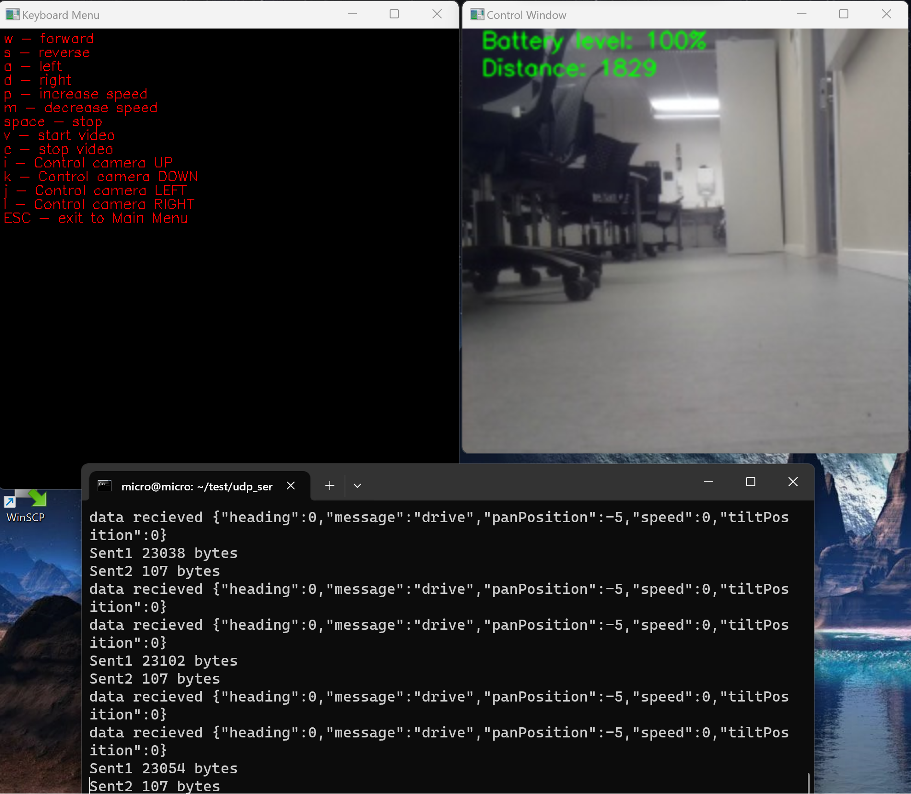

# AIS2203_Project_Sphero
Robot control - exam project for NTNU AIS2203

## Introduction
This project focuses on remotely controlling the Sphero RVR in real-time utilizing UDP communication protocols. 
It leverages multithreading and OpenCV, enabling simultaneous transmission and reception of data, as well as real-time display of images within the graphical user interface.

### What works.
- Duplex communication between Robot and client
- Keyboard Controls
- Xbox Controls
- Autonomous ball tracking (can be better)
- "live" videofeed with approx. 1 second delay
- Simple GUI implemented with openCV
- Collision detection
- Battery level indicator

### What does not work/ works poorly.
- GUI and camerafeed windows lock if clicked on with the mouse cursor.
- The robot is not very good at tracking the ball.
- Latency on the videofeed is too high.

The following files, tests and demos listed below are not implemented in relation with the Sphero RVR. But is a work in progress of a more advanced autonomous tracking system.
    
###### Demos
    - Color_calibration_demo
    - Task_manager_demo
    - Object_detection_demo
  ###### Files
    - PCCamera.hpp
    - RaspberryCamera.hpp
    - JsonConverter.hpp
    - JsonUtils.hpp
    - Observer.hpp
    - Task.Manager.hpp
    - Core folder
    - vision folder

### How to get it running
#### Server instructions
- Follow Sphero instructions to setup raspberry pi and Sphero RVR. (https://sdk.sphero.com/raspberry-pi-setup)
- Once the setup instructions are followed and a wifi and SSH connection is established, connect to the raspberry and run the following commands:
  - sudo apt-get update
  - sudo apt-get install git
  - pip3 install opencv-python (or sudo apt-get install python3-opencv)
  - pip3 install qwiic
  - pip3 install numpy
  - pip3 install pi_servo_hat

- Download the udp server on the raspberry pi. (https://github.com/tostoner/udp_server)
- Run Main.py using sudo and python3. (sudo python3 Main.py)

#### Client instructions
- This project is easiest built using vcpkg.
- Call CMake with `-DCMAKE_TOOLCHAIN_FILE=[path to vcpkg]/scripts/buildsystems/vcpkg.cmake` (using manifest mode).
- See [vcpkg.json](vcpkg.json) for available features.
- Set correct serverIP and serverPort in main.cpp (note: serverIP is the IP of the raspberry pi)

### UDP Server Github link
The UDP server was created on a separate git repo.
easily git pull 

https://github.com/tostoner/udp_server

### Screenshots
#### Main menu

#### Keyboard menu

#### Xbox menu

#### Program running

